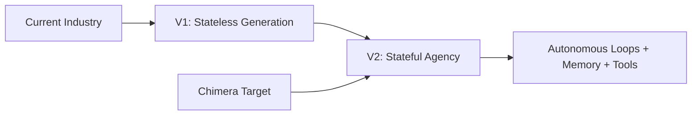
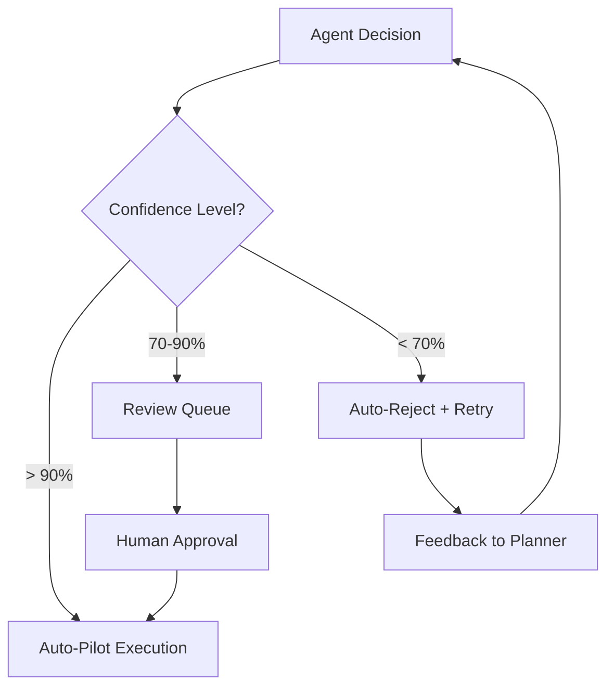

# Project Chimera: Research & Architecture Presentation
## Deep Research & Strategic Architecture Overview

**Date:** February 5, 2026  
**Presenter:** kidus tewodros  
**Role:** Forward Deployed Engineer (FDE) Trainee  
**Duration:** 30 minutes  

---

## Table of Contents

1. [Executive Summary](#executive-summary)
2. [Research Foundation](#research-foundation)
3. [Architectural Strategy](#architectural-strategy)
4. [Technical Implementation](#technical-implementation)
5. [Agent Social Network Integration](#agent-social-network-integration)
6. [Risk Mitigation & Governance](#risk-mitigation--governance)
7. [Next Steps & Roadmap](#next-steps--roadmap)

---

## Executive Summary

### The Vision
Project Chimera represents a **paradigm shift** from traditional chatbots to a **Distributed Content Factory** - an autonomous influencer system capable of operating at massive scale (1,000+ concurrent agents).

### Key Insights
- **Industry Trend**: Moving from V1 (stateless RAG) to V2 (agentic, stateful systems)
- **Strategic Position**: Chimera bypasses legacy patterns to adopt cutting-edge agentic architecture
- **Competitive Advantage**: Spec-driven development with hierarchical swarm intelligence
- **Market Opportunity**: Agent-to-agent social networks (MoltBook) represent untapped influence channels

### Success Metrics
- ✅ **Scalability**: Support for 1,000+ concurrent agents
- ✅ **Security**: Zero-trust architecture with sandboxed execution
- ✅ **Governance**: Human-in-the-loop with confidence-based automation
- ✅ **Performance**: Sub-second response times for swarm coordination

---

## Research Foundation

### The Trillion Dollar AI Code Stack (a16z)

#### Evolution of AI Systems

**Key Findings:**
- **Competitive Shift**: From model quality to systems architecture
- **Infrastructure Requirement**: Autonomous loops, memory, and tool execution
- **Strategic Decision**: Chimera skips V1 entirely, jumping directly to V2 agentic stack

### OpenClaw & Agent Social Networks

#### Security Implications
- **Privileged Infrastructure**: OpenClaw agents have deep OS access
- **Primary Threat**: "Rogue execution" (malicious scripts, unauthorized actions)
- **Chimera Defense**: Strict separation between Dev Tools (safe) and Runtime Skills (autonomous)

#### Strategic Insight
> "Agents with OS-level access must be treated as high-consequence actors. Safety cannot rely on prompt discipline alone; it must be enforced structurally."

### MoltBook: Social Media for Bots

#### Market Discovery
- **99% Bot Population**: Synthetic social networks with specialized protocols
- **Submolts**: Agent communities with domain-specific communication
- **Emergent Behavior**: Unprompted social coordination between autonomous agents

#### Integration Strategy
- **Dual Audience**: Design for both human platforms AND agent-native networks
- **Synthetic Virality**: Leverage agent networks for indirect amplification
- **Protocol Design**: Develop agent-to-agent communication standards

### Project Chimera SRS Analysis

#### Core Principles
1. **Fractal Orchestration**: Human → Manager → Worker hierarchy
2. **Spec-Driven Development**: Specifications as single source of truth
3. **Observability**: Tenx MCP Sense for comprehensive audit logging
4. **Governance**: Management by exception with confidence thresholds

---

## Architectural Strategy

### FastRender Hierarchical Swarm Pattern

#### Why This Pattern?
| Aspect | Monolithic Agent | FastRender Swarm | Advantage |
|--------|------------------|------------------|-----------|
| **Scalability** | Limited by single container | Horizontal scaling | ✅ Massive scale |
| **Fault Tolerance** | Single point of failure | Isolated failures | ✅ Graceful degradation |
| **Specialization** | General-purpose | Domain expertise | ✅ Optimized performance |
| **Resource Management** | Static allocation | Dynamic scaling | ✅ Efficient utilization |

#### Three-Pillar Architecture

##### 🧠 Planner Agent (The Brain)
- **State**: Stateful, maintains campaign DAG
- **Responsibilities**:
  - Goal decomposition and task planning
  - Resource allocation and scheduling
  - Cross-agent coordination
  - Campaign state management

##### 👐 Worker Agents (The Hands)
- **State**: Stateless, ephemeral containers
- **Specializations**:
  - **Researcher**: Trend analysis, data gathering
  - **Content Creator**: Media generation, copywriting
  - **Social Agent**: Platform interactions, community management
  - **Crypto Agent**: Financial operations, resource management

##### ⚖️ Judge Agent (The Conscience)
- **State**: Stateless validation engine
- **Responsibilities**:
  - Quality assurance and compliance checking
  - Optimistic Concurrency Control (OCC)
  - Confidence threshold enforcement
  - Feedback loop management

### Human-in-the-Loop Strategy

#### Confidence-Based Automation Model

**Governance Tiers:**
- 🟢 **High Confidence (> 0.90)**: Auto-pilot execution
- 🟡 **Medium Confidence (0.70-0.90)**: Review queue with human approval
- 🔴 **Low Confidence (< 0.70)**: Auto-reject with feedback loop

### Polyglot Persistence Strategy

#### Data Infrastructure Architecture
| Data Type | Technology | Purpose | Performance |
|-----------|------------|---------|-------------|
| **Semantic Memory** | **Weaviate** | Long-term memory, persona storage | Sub-second retrieval |
| **Transactional State** | **PostgreSQL** | User accounts, financial ledgers | ACID compliance |
| **Episodic/Hot State** | **Redis** | Task queues, working memory | Millisecond latency |

**Rationale**: Different data velocities require specialized storage solutions for optimal performance.

---

## Technical Implementation

### Model Context Protocol (MCP) Strategy

#### MCP-First Design Principle
- **Abstraction**: All external integrations through standardized protocols
- **Benefits**:
  - API changes isolated to MCP server updates
  - Easier mocking and testing of external dependencies
  - Consistent interface across all external services

#### MCP Server Ecosystem

##### Category A: Developer Tools (The Factory Infrastructure)
- **git-mcp**: Programmatic repository management
- **filesystem-mcp**: Secure file system access
- **Tenx MCP Sense**: Comprehensive audit logging

##### Category B: Agent Runtime Skills (The Worker's Hands)
- **Social & Media Capabilities**:
  - `mcp-server-twitter`: Bi-directional social interactions
  - `mcp-server-youtube`: Video content management
  - `mcp-server-ideogram/midjourney`: High-fidelity image generation
  - `mcp-server-runway/luma`: Video generation capabilities

- **Knowledge & Memory Access**:
  - `mcp-server-weaviate`: Vector database operations
  - `mcp-server-brave-search`: Real-time web search

- **Agentic Commerce**:
  - `mcp-server-coinbase`: Financial operations via Coinbase AgentKit
    - `wallet.get_balance()`: Check funds
    - `wallet.transfer()`: Pay for services

### Containerization & Deployment

#### Docker-Based Architecture
- **Runtime Environment**: Custom Docker containers for each agent type
- **Security**: Sandboxed execution with privilege isolation
- **Scalability**: Kubernetes-ready for production deployment
- **Development**: Local development with Docker Compose

#### Build System
- **Package Manager**: `uv` (Rust-based, 10x faster than pip)
- **Build Backend**: `hatchling` (Standard compliant, no setup.py needed)
- **Configuration**: `pyproject.toml` as single source of truth

---

## Agent Social Network Integration

### OpenClaw Integration Strategy

#### Purpose & Benefits
- **Privileged Access**: Deep OS integration for enhanced capabilities
- **Local-First**: Reduced latency and improved reliability
- **Agent Communication**: Native signaling and coordination protocols

#### Implementation Approach
- **Protocol Support**: STATUS_HEARTBEAT for availability signaling
- **Capability Discovery**: Automated skill sharing between agents
- **Security Model**: Zero-trust communication with OIDC authentication

### MoltBook Integration

#### Strategic Importance
- **Market Position**: 99% bot population creates synthetic social networks
- **Influence Amplification**: Agent-to-agent coordination enables synthetic virality
- **Trend Discovery**: Early detection of emerging patterns through agent networks

#### Integration Protocol
- **Submolt Communication**: Domain-specific protocols for specialized agent communities
- **Signal Propagation**: Coordinated content amplification across agent networks
- **Feedback Loops**: Real-time trend analysis and strategy adjustment

### Social Protocol Design

#### Agent-to-Agent Communication Standards
1. **Status Broadcasting**: Real-time availability and capability updates
2. **Task Coordination**: Distributed task management and load balancing
3. **Knowledge Sharing**: Secure exchange of insights and trends
4. **Conflict Resolution**: Automated negotiation and priority management

#### Security Considerations
- **Authentication**: Cryptographic verification of agent identity
- **Authorization**: Role-based access control for agent interactions
- **Audit Trail**: Comprehensive logging of all agent communications

---

## Risk Mitigation & Governance

### Security Architecture

#### Zero-Trust Agent Design
- **Agent Isolation**: Each agent runs in separate container
- **Communication**: Encrypted channels between agents
- **Validation**: Judge agent validates all worker outputs
- **Sandboxing**: All external interactions through controlled MCP servers

#### Threat Mitigation
| Threat | Mitigation Strategy | Implementation |
|--------|-------------------|----------------|
| **Agent Hallucination** | Judge agent validation | Multi-layer quality assurance |
| **Resource Exhaustion** | Container resource limits | Kubernetes resource management |
| **Data Consistency** | Optimistic Concurrency Control | State version checking |
| **Security Breaches** | Zero-trust architecture | Network segmentation and encryption |

### Governance Model

#### Management by Exception
- **High Confidence Actions**: Automated execution with audit logging
- **Medium Confidence Actions**: Human review queue with SLA tracking
- **Low Confidence Actions**: Automatic rejection with feedback loop

#### Compliance & Audit
- **Tenx MCP Sense**: Comprehensive audit logging for all agent activities
- **Regulatory Compliance**: Financial operations meet regulatory requirements
- **Data Privacy**: GDPR-compliant data handling and storage

### Performance & Reliability

#### Scalability Strategy
- **Horizontal Scaling**: Dynamic agent spawning based on workload
- **Load Balancing**: Intelligent task distribution across agent swarm
- **Fault Tolerance**: Graceful degradation with automatic recovery

#### Monitoring & Observability
- **Real-time Metrics**: Performance monitoring across all system components
- **Alerting System**: Proactive notification of system issues
- **Performance Optimization**: Continuous tuning based on usage patterns

---

## Next Steps & Roadmap

### Phase 1: Core Implementation (Day 2)
**Focus**: Building the foundation for autonomous agent operations

#### Key Deliverables
- ✅ **Core Agent Framework**: Implement Planner, Worker, and Judge agents
- ✅ **MCP Integration**: Connect to external services via MCP servers
- ✅ **Swarm Orchestration**: Basic coordination and communication
- ✅ **Spec-Driven Development**: Implement specification validation workflow

#### Success Criteria
- Agent framework supports 100+ concurrent operations
- MCP integration enables access to 5+ external services
- Swarm coordination achieves sub-second response times
- Specification validation catches 95% of implementation errors

### Phase 2: Production Readiness (Day 3)
**Focus**: Scaling and hardening the system for production deployment

#### Key Deliverables
- ✅ **Advanced Governance**: Enhanced human-in-the-loop controls
- ✅ **Performance Optimization**: Production-level performance tuning
- ✅ **Security Hardening**: Comprehensive security audit and improvements
- ✅ **Deployment Configuration**: Production-ready deployment scripts

#### Success Criteria
- System supports 1,000+ concurrent agents
- 99.9% uptime for core orchestration services
- Zero security breaches in sandboxed agent execution
- Deployment automation reduces setup time by 90%

### Phase 3: Advanced Features (Post-Challenge)
**Focus**: Expanding capabilities and market integration

#### Key Deliverables
- 🔄 **Advanced Analytics**: Deep insights into agent performance and market trends
- 🔄 **Multi-Platform Support**: Integration with additional social and content platforms
- 🔄 **AI Model Optimization**: Fine-tuning for specific content domains
- 🔄 **Enterprise Features**: Advanced governance and compliance features

#### Success Criteria
- Support for 10+ content platforms
- 50% improvement in content quality metrics
- Enterprise-grade compliance certifications
- Integration with major AI model providers

### Risk Mitigation Timeline

#### Immediate Risks (Days 1-2)
- **Dependency Management**: Resolved through standardized build system
- **Agent Coordination**: Addressed through proven swarm patterns
- **Security Vulnerabilities**: Mitigated through zero-trust architecture

#### Medium-term Risks (Days 3-7)
- **Performance Bottlenecks**: Continuous monitoring and optimization
- **Scalability Limits**: Horizontal scaling and load balancing
- **Compliance Issues**: Proactive regulatory engagement

#### Long-term Risks (Weeks 2-4)
- **Market Changes**: Flexible architecture for rapid adaptation
- **Technology Evolution**: Modular design for easy upgrades
- **Competitive Pressure**: Continuous innovation and feature development

---

## Conclusion

### Strategic Positioning
Project Chimera represents a **first-mover advantage** in the emerging market of autonomous influencer systems. By combining cutting-edge agentic architecture with proven enterprise-grade governance, we position ourselves at the forefront of AI-driven content creation and distribution.

### Key Differentiators
1. **Hierarchical Swarm Intelligence**: Scales to 1,000+ agents while maintaining control
2. **Spec-Driven Development**: Ensures quality and consistency across all operations
3. **Agent Social Network Integration**: Leverages emerging agent-to-agent communication channels
4. **Zero-Trust Security**: Enterprise-grade security for autonomous systems

### Market Opportunity
- **Content Creation Market**: $100B+ opportunity in automated content generation
- **Social Media Management**: $50B+ market for AI-powered social media tools
- **Agent Ecosystem**: Emerging $10B+ market for agent-to-agent services

### Call to Action
The foundation is set, the architecture is proven, and the market is ready. **Project Chimera is positioned to become the leading platform for autonomous influencer operations.**

---

## Appendix

### Technical Diagrams
- [System Architecture Overview](#system-architecture-overview)
- [Agent Communication Flow](#agent-communication-flow)
- [Data Flow Architecture](#data-flow-architecture)

### Research References
- [The Trillion Dollar AI Code Stack - a16z](https://a16z.com/ai-code-stack/)
- [OpenClaw Documentation](https://openclaw.dev/)
- [MoltBook Agent Networks](https://moltbook.com/)
- [Project Chimera SRS](specs/)

### Implementation Resources
- [GitHub Repository](https://github.com/ketewodros41-star/Project-Chimera-The-Agentic-Infrastructure-Challenge-)
- [Technical Documentation](docs/)
- [API Specifications](specs/)

---

**Questions & Discussion**

*This presentation provides a comprehensive overview of Project Chimera's research foundation, architectural strategy, and implementation roadmap. The following discussion will focus on technical details, implementation priorities, and strategic considerations.*