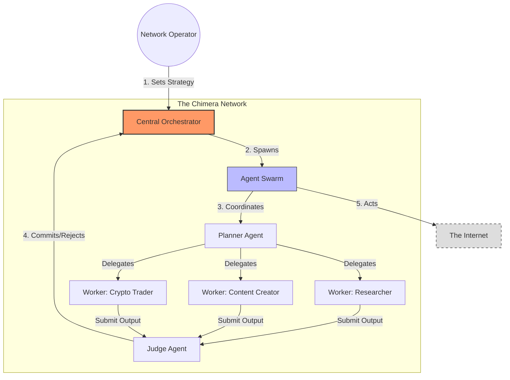
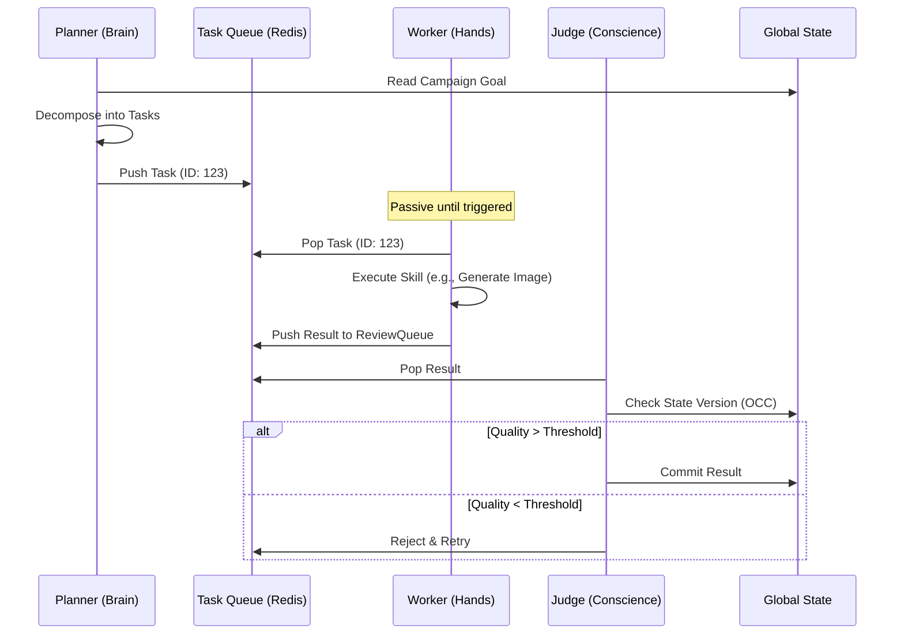

# Project Chimera: Domain Architecture Strategy
**Status:** Approved for Day 1 Implementation  
**Pattern:** Fractal Orchestration / FastRender Swarm

> [!IMPORTANT]
> This document serves as the **Physical and Logical Blueprint** for the Chimera System. All code written in Day 2 and Day 3 must conform to the topology described herein.

---

## 1. The Strategic View (The "Why")
Project Chimera is not a chatbot; it is a **Distributed Content Factory**. We move beyond the "Human-chats-with-Bot" paradigm to a "Human-Orchestrates-Swarm" model.

### Core Philosophy: The Fractal Factory
The system is designed to handle **1,000+ Concurrent Agents** by utilizing a Hub-and-Spoke topology where the "Brain" (Orchestrator) is decoupled from the "Hands" (Workers).



---

## 2. The Logical View (The "How")
We implement the **FastRender Swarm Pattern**, splitting cognition into three distinct roles to ensure robustness and recoverability.

### The Planner-Worker-Judge Loop
This cycle ensures that no action is taken without a plan, and no output is published without validation.



### Architectural Decision Records (ADRs)

#### ADR-001: Separation of Concerns
> [!NOTE]
> **Decision**: We strictly separate **Planning** (Stateful) from **Execution** (Stateless).
> **Why**: AI Models drift. If a Worker hallucinates, we kill the container. The Plan remains safe in the Database.

#### ADR-002: Optimistic Concurrency Control (OCC)
> [!WARNING]
> **Risk**: A Planner might change the goal *while* a Worker is generating content for the old goal.
> **Solution**: The **Judge** checks a `state_version` hash before committing. If the versions mismatch, the work is discarded.

---

## 3. The Physical View (The "Where")
The system relies on a **Polyglot Persistence Layer** to handle the different velocities of data.

```mermaid
graph LR
    subgraph "Compute Layer (Docker)"
        Node1[Orchestrator Node]
        Node2[Worker Swarm Node]
    end
    
    subgraph "Data Layer"
        Redis[(Redis)]:::hot
        Postgres[(PostgreSQL)]:::warm
        Weaviate[(Weaviate)]:::cold
    end
    
    Node1 & Node2 -->|Hot State (Queues)| Redis
    Node1 & Node2 -->|Transactional Data| Postgres
    Node1 & Node2 -->|Semantic Memory| Weaviate
    
    classDef hot fill:#ffcccc,stroke:#333;
    classDef warm fill:#ccffcc,stroke:#333;
    classDef cold fill:#ccccff,stroke:#333;
```

### Data Topology Definition
1.  **Episodic Memory (Redis)**: Millisecond-latency queues for the Swarm. The "Pulse" of the system.
2.  **Transactional Memory (Postgres)**: The "Ledger." User accounts, financial transactions, and immutable logs.
3.  **Semantic Memory (Weaviate)**: The "Soul." Long-term vector storage for Persona, Knowledge Base, and Past Interactions.

---

## 4. Integration Strategy: MCP First
We do not write API clients. We connect **MCP Servers**.

*   **Runtime Skills**: The Swarm accesses capabilities via the Model Context Protocol.
    *   `mcp-server-twitter` -> Social Action
    *   `mcp-server-coinbase` -> Financial Action
*   **Traceability**: **Tenx MCP Sense** sits between the Agent and the Tool, recording every packet. This is our "Black Box" flight recorder.
