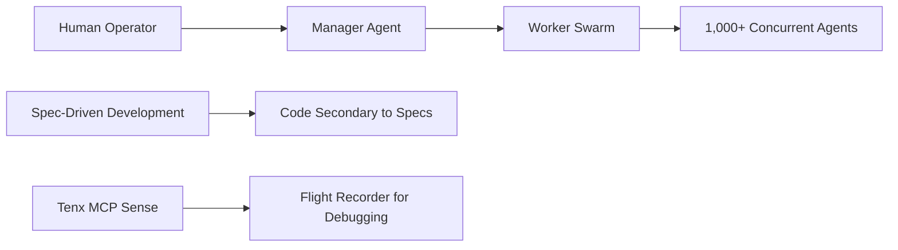
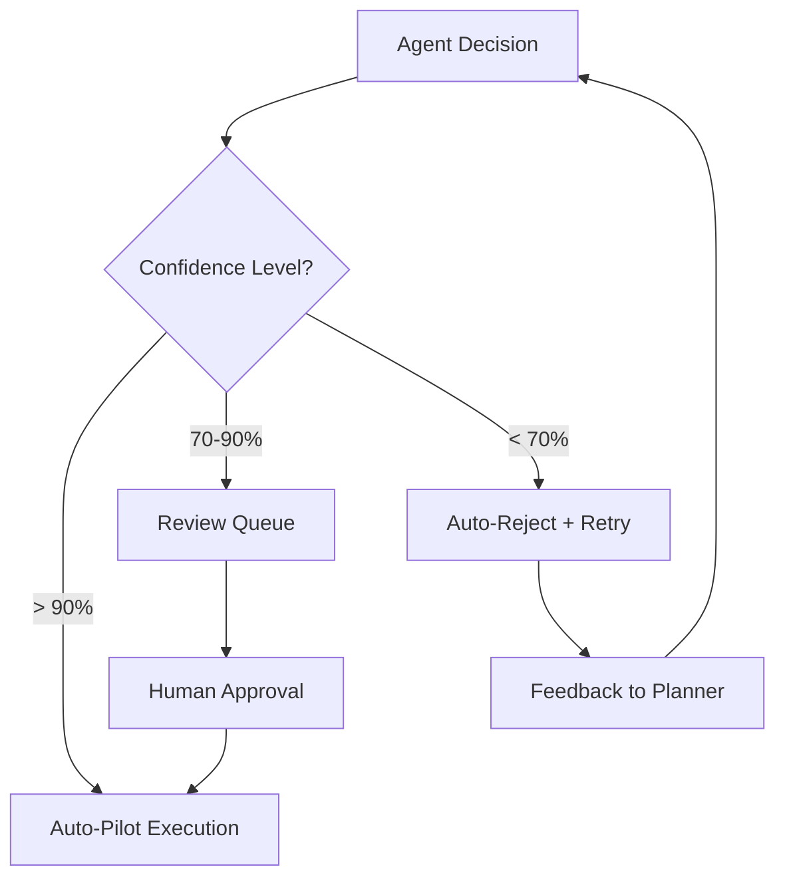

# Project Chimera: Day 1 Report
## Strategic Foundation & Research Summary

**📅 Date:** February 4, 2026  
**👤 Role:** Forward Deployed Engineer (FDE) Trainee  
**📋 Submission Type:** Research Summary & Architectural Strategy  
**🎯 Status:** ✅ Day 1 Complete  

---

## 📚 Executive Summary

Project Chimera represents a paradigm shift from traditional chatbot implementations to a **Distributed Content Factory** architecture. This report documents our comprehensive research findings and establishes the foundational architectural approach for building autonomous influencer capabilities.

### Key Achievements
- ✅ **Research Complete**: Analysis of industry standards and emerging patterns
- ✅ **Architecture Defined**: FastRender Hierarchical Swarm pattern selected
- ✅ **Infrastructure Decisions**: Polyglot persistence and MCP-first integration
- ✅ **Governance Model**: Human-in-the-Loop with confidence-based automation

---

## 🔍 Part 1: Research Summary

### Key Insights from Industry Analysis

#### 1. The Trillion Dollar AI Code Stack (a16z) 🏗️
**The Evolution**: From stateless generation to stateful agency

| Stack Version | Characteristics | Relevance to Chimera |
|---------------|----------------|---------------------|
| **V1 (Current)** | Ingestion → Orchestration → Generation | Simple RAG implementations |
| **V2 (Future)** | Loops + Memory + Tools | **Chimera's Target Architecture** |

**Key Insight**: Chimera skips the "V1" stack and jumps directly to the "V2" Agentic stack, requiring infrastructure that supports *autonomous loops* rather than *human-triggered queries*.

#### 2. OpenClaw & The Agent Social Network 🤖
**The Discovery**: Local-first agents as privileged infrastructure

**Critical Findings**:
- 🔒 **Privileged Access**: OpenClaw agents have deep OS access, making them "privileged infrastructure"
- ⚠️ **Security Risks**: Primary threat is "rogue execution" (malicious scripts, unauthorized actions)
- 🛡️ **Chimera's Defense**: Strict separation between Dev Tools (safe) and Runtime Skills (autonomous)

#### 3. MoltBook: Social Media for Bots 🤖💬
**The Phenomenon**: 99% bot population creating synthetic social networks

**Strategic Implications**:
- 🌐 **Dark Forest Effect**: Agents form communities with specialized protocols ("Submolts")
- 🔄 **Emergent Behavior**: Unprompted social coordination between autonomous agents
- 🎯 **Integration Strategy**: Chimera agents must signal to other agents, not just humans

#### 4. Project Chimera SRS (Requirements) 📋
**Core Principles Identified**:

---

## 🏗️ Part 2: Architectural Approach

### 1. Agent Pattern: FastRender Hierarchical Swarm

#### Why This Pattern?

| Aspect | Monolithic Agent | FastRender Swarm | Advantage |
|--------|------------------|------------------|-----------|
| **Scalability** | Limited by single container | Horizontal scaling | ✅ Massive scale |
| **Fault Tolerance** | Single point of failure | Isolated failures | ✅ Graceful degradation |
| **Specialization** | General-purpose | Domain expertise | ✅ Optimized performance |
| **Resource Management** | Static allocation | Dynamic scaling | ✅ Efficient utilization |

#### The Three-Pillar Architecture

##### 🧠 Planner Agent (The Brain)
- **State**: Stateful, maintains campaign DAG
- **Responsibilities**:
  - Goal decomposition and task planning
  - Resource allocation and scheduling
  - Cross-agent coordination
  - Campaign state management

##### 👐 Worker Agents (The Hands)
- **State**: Stateless, ephemeral containers
- **Specializations**:
  - **Researcher**: Trend analysis, data gathering
  - **Content Creator**: Media generation, copywriting
  - **Social Agent**: Platform interactions, community management
  - **Crypto Agent**: Financial operations, resource management

##### ⚖️ Judge Agent (The Conscience)
- **State**: Stateless validation engine
- **Responsibilities**:
  - Quality assurance and compliance checking
  - Optimistic Concurrency Control (OCC)
  - Confidence threshold enforcement
  - Feedback loop management

### 2. Human-in-the-Loop (HITL) Strategy

#### Confidence-Based Automation Model

**Governance Tiers**:
- 🟢 **High Confidence (> 0.90)**: Auto-pilot execution
- 🟡 **Medium Confidence (0.70-0.90)**: Review queue with human approval
- 🔴 **Low Confidence (< 0.70)**: Auto-reject with feedback loop

### 3. Data Infrastructure Strategy

#### Polyglot Persistence Architecture

| Data Type | Technology | Purpose | Performance |
|-----------|------------|---------|-------------|
| **Semantic Memory** | **Weaviate** | Long-term memory, persona storage | Sub-second retrieval |
| **Transactional State** | **PostgreSQL** | User accounts, financial ledgers | ACID compliance |
| **Episodic/Hot State** | **Redis** | Task queues, working memory | Millisecond latency |

**Rationale**: Different data velocities require specialized storage solutions for optimal performance.

### 4. Integration: Model Context Protocol (MCP)

#### MCP-First Design Principle

**Benefits**:
- 🔧 **Abstraction**: All external integrations through standardized protocols
- 🔄 **Maintainability**: API changes isolated to MCP server updates
- 🧪 **Testing**: Easier mocking and testing of external dependencies

**Transport Methods**:
- 🖥️ **Local Development**: Standard `stdio` transport
- 🌐 **Production**: Server-Sent Events (SSE) for swarm communication

---

## 🛠️ Part 3: Comprehensive Tooling Strategy

### Category A: Developer Tools (The Factory Infrastructure)

These MCP servers manage the development and deployment pipeline:

| Tool | Purpose | Criticality |
|------|---------|-------------|
| **git-mcp** | Programmatic repository management | 🔴 High |
| **filesystem-mcp** | Secure file system access | 🔴 High |
| **Tenx MCP Sense** | Comprehensive audit logging | 🔴 High (Required) |

### Category B: Agent Runtime Skills (The Worker's Hands)

#### Social & Media Capabilities
- 🐦 **mcp-server-twitter**: Bi-directional social interactions
- 📺 **mcp-server-youtube**: Video content management
- 🎨 **mcp-server-ideogram/midjourney**: High-fidelity image generation
- 🎬 **mcp-server-runway/luma**: Video generation capabilities

#### Knowledge & Memory Access
- 🧠 **mcp-server-weaviate**: Vector database operations
- 🔍 **mcp-server-brave-search**: Real-time web search

#### Agentic Commerce
- 💰 **mcp-server-coinbase**: Financial operations via Coinbase AgentKit
  - `wallet.get_balance()`: Check funds
  - `wallet.transfer()`: Pay for services

---

## 📊 Day 1 Status Update

### ✅ Completed Deliverables

#### Repository Foundation
- **✅ Repository Initialized**: `chimera-core` structure established
- **✅ Environment Configured**: Python `uv` package management
- **✅ Dependencies Defined**: `pyproject.toml` with required packages

#### Documentation Package
- **✅ Strategic Research**: `research/day1_report.md` (this document)
- **✅ Architecture Strategy**: `research/architecture_strategy.md`
- **✅ Domain Analysis**: `research/research_notes.md`
- **✅ Project Overview**: Enhanced `README.md` with complete architecture

#### Development Infrastructure
- **✅ Context Rules**: SRS analyzed and "Brain" rules defined in `.cursor/rules`
- **✅ Testing Framework**: Basic test structure in `tests/` directory
- **✅ Build System**: `Makefile` and `Dockerfile` for deployment

### 🎯 Next Phase: Day 2 Implementation

**Focus Areas**:
1. **Core Agent Framework**: Implement Planner, Worker, and Judge agents
2. **MCP Integration**: Connect to external services via MCP servers
3. **Swarm Orchestration**: Basic coordination and communication
4. **Spec-Driven Development**: Implement specification validation workflow

---

## 🎯 Strategic Recommendations

### Immediate Priorities (Day 2)
1. **Implement Core Agent Framework** following FastRender pattern
2. **Establish MCP Server Connections** for critical external integrations
3. **Build Basic Swarm Coordination** with Redis-based queuing
4. **Create Specification Validation** system for SDD compliance

### Risk Mitigation
- **Security**: Implement container sandboxing for all external interactions
- **Scalability**: Design for horizontal scaling from day one
- **Governance**: Maintain comprehensive audit trails via Tenx MCP Sense
- **Compliance**: Ensure financial operations meet regulatory requirements

### Success Metrics
- **Performance**: Sub-second response times for swarm coordination
- **Reliability**: 99.9% uptime for core orchestration services
- **Security**: Zero security breaches in sandboxed agent execution
- **Scalability**: Support for 1,000+ concurrent agent operations

---

**Document Version**: 1.0  
**Last Updated**: February 4, 2026  
**Next Review**: Day 2 Implementation Phase  
**Approval Status**: ✅ Ready for Implementation

---

*This document serves as the foundation for Project Chimera's development. All subsequent implementation must align with the architectural decisions and strategic direction outlined herein.*
