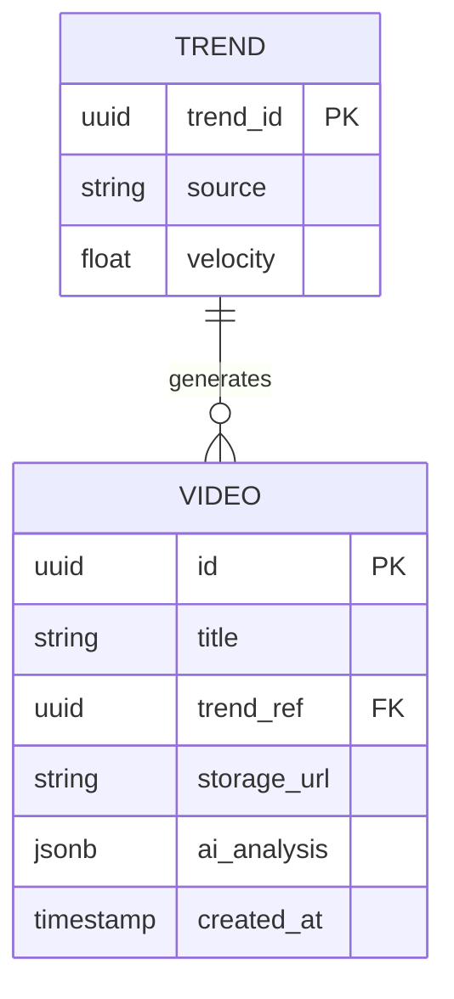

# Project Chimera: Technical Specification

## API Contracts

### Trend Data Structure
```json
{
  "trend_id": "uuid",
  "source": "openclaw",
  "topic": "string",
  "velocity": "float",
  "metadata": {
    "tags": ["string"],
    "mentions": ["string"]
  }
}
```

### Skill Interface: `skill_download_youtube` [FR-2.1]
- **Input:** `{"url": "string"}`
- **Output:** `{"filepath": "string"}`

### Skill Interface: `skill_transcribe_audio` [FR-2.2]
- **Input:** `{"audio_path": "string"}`
- **Output:** `{"transcript": "string"}`

### Skill Interface: `skill_generate_caption` [FR-2.3]
- **Input:** `{"trend_data": "dict"}`
- **Output:** `{"caption": "string"}`

### Universal Task Contract (`AgentTask`)
Matches SRS §6.2 Schema 1.
```json
{
  "task_id": "uuid",
  "skill": "string",
  "parameters": "json",
  "priority": "int (1-10)",
  "state_version": "iso8601",
  "deadline": "timestamp"
}
```

### Universal Result Contract
```json
{
  "task_id": "uuid",
  "status": "success | failure",
  "payload": "json",
  "error": "string | null",
  "confidence": "float (0.0-1.0)",
  "state_version": "iso8601"
}
```

### MCP Tool Definition
Matches SRS §6.2 Schema 2.
```json
{
  "name": "string",
  "description": "string",
  "input_schema": "json_schema",
  "output_schema": "json_schema"
}
```

## Governance Logic

### Optimistic Concurrency Control (OCC)
The Judge Agent MUST verify that the `state_version` in the Result matches the `state_version` in the Current Global State. If the state has drifted (Result.state_version < Current.state_version), the commit must be REJECTED.

## Database Schema (ERD) [FR-6.0]



### Video Metadata Table [FR-6.1]
- `id`: UUID (Primary Key)
- `title`: String
- `trend_ref`: UUID (Foreign Key)
- `storage_url`: String
- `ai_analysis`: JSONB (Visual/Audio transcriptions)
- `created_at`: Timestamp

### Agent Memory
- Vector embedding of content and engagement feedback for long-term personality persistence.

## Infrastructure
- **Python:** 3.12+ (managed by `uv`).
- **Containers:** Docker for deployment.
- **Automation:** Makefile for simplified dev ops.
