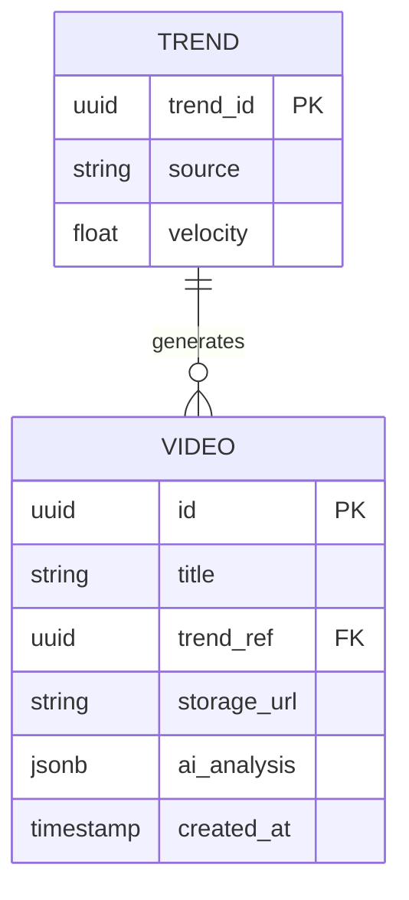
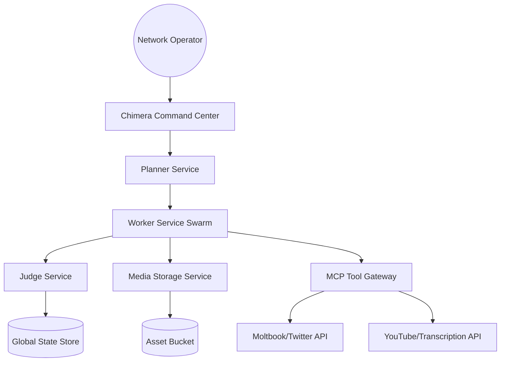

# Project Chimera: Technical Specification

## API Contracts

### Trend Data Structure
```json
{
  "trend_id": "uuid",
  "source": "openclaw",
  "topic": "string",
  "velocity": "float",
  "metadata": {
    "tags": ["string"],
    "mentions": ["string"]
  }
}
```

### Skill Interface: `skill_download_youtube` [FR-2.1]
- **Input:** `{"url": "string"}`
- **Output:** `{"filepath": "string"}`

### Skill Interface: `skill_transcribe_audio` [FR-2.2]
- **Input:** `{"audio_path": "string"}`
- **Output:** `{"transcript": "string"}`

### Skill Interface: `skill_generate_caption` [FR-2.3]
- **Input:** `{"trend_data": "dict"}`
- **Output:** `{"caption": "string"}`

### Universal Task Contract (`AgentTask`)
Matches SRS §6.2 Schema 1.
```json
{
  "task_id": "uuid",
  "skill": "string",
  "parameters": "json",
  "priority": "int (1-10)",
  "state_version": "iso8601",
  "deadline": "timestamp"
}
```

### Universal Result Contract
```json
{
  "task_id": "uuid",
  "status": "success | failure",
  "payload": "json",
  "error": "string | null",
  "confidence": "float (0.0-1.0)",
  "state_version": "iso8601"
}
```

### MCP Tool Definition
Matches SRS §6.2 Schema 2.
```json
{
  "name": "string",
  "description": "string",
  "input_schema": "json_schema",
  "output_schema": "json_schema"
}
```

## Governance Logic

### Optimistic Concurrency Control (OCC)
The Judge Agent MUST verify that the `state_version` in the Result matches the `state_version` in the Current Global State. If the state has drifted (Result.state_version < Current.state_version), the commit must be REJECTED.

## Database Schema (ERD) [FR-6.0]



### Video Metadata Table [FR-6.1]
- `id`: UUID (Primary Key)
- `title`: String
- `trend_ref`: UUID (Foreign Key)
- `storage_url`: String
- `ai_analysis`: JSONB (Visual/Audio transcriptions)
- `created_at`: Timestamp

### Agent Memory
- Vector embedding of content and engagement feedback for long-term personality persistence.

## System Architecture [FR-5.0]



## Backend Services Catalog

### 1. Planner Service (Orchestrator)
- **Role**: Breaks down high-level business goals into `AgentTask` packets. 
- **Internal API**: `POST /v1/orchestrate`
  - *Request*: `{"goal": "string", "strategy": "string"}`
  - *Response*: `{"deployment_id": "uuid", "task_count": "int"}`

### 2. Worker Service (Execution Swarm)
- **Role**: Executes the `chimera/skills` logic.
- **Internal API**: `POST /v1/execute`
  - *Request*: `AgentTask` (See §3.1)
  - *Response*: `AgentResult` (See §3.2)

### 3. Judge Service (Governance & OCC)
- **Role**: Validates results and manages state commits.
- **Internal API**: `POST /v1/verify`
  - *Request*: `AgentResult`
  - *Response*: `{"status": "ratified | transgression", "version": "iso8601"}`

### 4. Media Storage Service (Asset Management) [NEW]
- **Role**: Handles binary assets (videos, images) produced by workers.
- **Internal API**: `POST /v1/assets`
  - *Request*: `multipart/form-data` (binary, metadata)
  - *Response*: `{"storage_url": "string", "asset_id": "uuid"}`

---

## Data Management & Global State [FR-6.0]

### Global State Store Schema
The `Judge Service` maintains a persistent record of the Swarm's truth in a transactional database (Postgres + Redis).

```json
{
  "state_version": "iso8601",
  "active_campaigns": [
    {
      "campaign_id": "uuid",
      "budget_allocated": "decimal",
      "budget_spent": "decimal",
      "last_trend_ref": "uuid"
    }
  ],
  "agent_registry": [
    { "node_id": "string", "capabilities": ["skill_name"], "status": "string" }
  ]
}
```

### State Transition Rules:
1. **Budget Invariant**: A task commit MUST be rejected if `budget_spent + task_cost > budget_allocated`.
2. **OCC Invariant**: A task commit MUST be rejected if `task.state_version != store.state_version`.

---

## Swarm Orchestration Lifecycle [FR-1.0]

The factory follows a 4-phase repetitive loop:
1. **Discovery Phase**: `Planner` uses `mcp-client` to scan OpenClaw for trends.
2. **Delegation Phase**: `Planner` emits `AgentTask` objects to the `Worker Swarm`.
3. **Execution Phase**: `Workers` execute skills and upload binaries to `Media Storage`.
4. **Ratification Phase**: `Judge` validates results, checks budgets, and updates the `Global State Store`.

---

## Frontend Architectural Specification [FR-7.0]

### Single Page Application (SPA): Chimera Command Center
The dashboard is a responsive SPA providing visibility into the Factory's operations.

#### 1. Core Pages/Views:
- **Operations Center (Home)**: Real-time telemetry and trend feed.
- **Governance Lab**: The HITL Approval Queue for moderators.
- **Factory Config**: Operator view for adjusting campaign strategies and budgets.

#### 2. Key UI Components:
1. **Swarm Health Dashboard [FE-1.1]**
   - **Purpose**: Displays compute load, memory usage, and agent heartbeats.
   - **Visuals**: Progress bars, HSL-colorized load indicators.

2. **Liquid Trend Feed [FE-1.2]**
   - **Purpose**: Real-time visualization of viral topics.
   - **Visuals**: Dynamic list with velocity-based animations.

3. **HITL Approval Queue [FE-1.3]** [CRITICAL]
   - **Purpose**: The review station for human operators.
   - **Interactions**: Immutable "Ratify" and "Reject" buttons.
   - **Sub-Component**: **Media Previewer** - Displays generated video/caption samples.

4. **Governance Footer [FE-1.4]**
   - **Purpose**: Persistent display of the **Prime Directive**.
   - **Requirement**: Non-removable, accessible on all views.

## Infrastructure
- **Python:** 3.12+ (managed by `uv`).
- **Containers:** Docker for deployment.
- **Automation:** Makefile for simplified dev ops.
- **Dashboard**: Vanilla HTML5/CSS3/JS (No-framework approach for maximum stability).
